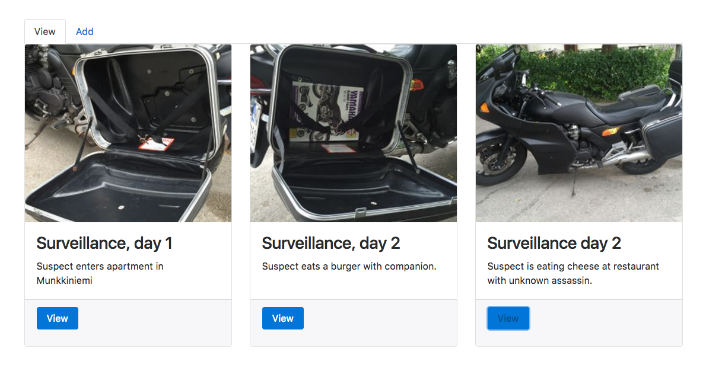
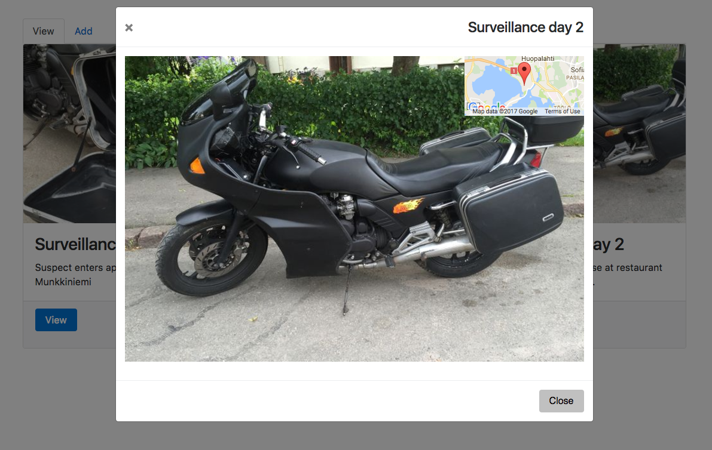

# Week assignment 1

You are given a predefined set of data (spyArray). Your task is to create an app which displays the data on a web page using ES6.

```JavaScript
const spyArray = [
  {
    "id": 12,
    "time": "2017-03-02 22:55",
    "category": "Wife",
    "title": "Title 1",
    "details": "Lorem ipsum dolor sit amet, consectetur adipiscing elit. Duis sodales enim eget leo condimentum vulputate. Sed lacinia consectetur fermentum. Vestibulum lobortis purus id nisi mattis posuere. Praesent sagittis justo quis nibh ullamcorper, eget elementum lorem consectetur. Pellentesque eu consequat justo, eu sodales eros.",
    "coordinates": {
      "lat": 60.2196781,
      "lng": 24.8079786
    },
    "thumbnail": "http://placekitten.com/320/300",
    "image": "http://placekitten.com/768/720",
    "original": "http://placekitten.com/2048/1920"
  },
  {
    "id": 15,
    "time": "2017-03-01 19:23",
    "category": "Wife",
    "title": "Title 2",
    "details": "Donec dignissim tincidunt nisl, non scelerisque massa pharetra ut. Sed vel velit ante. Aenean quis viverra magna. Praesent eget cursus urna. Ut rhoncus interdum dolor non tincidunt. Sed vehicula consequat facilisis. Pellentesque pulvinar sem nisl, ac vestibulum erat rhoncus id. Vestibulum tincidunt sapien eu ipsum tincidunt pulvinar. ",
    "coordinates": { "lat": 60.3196781, "lng": 24.9079786 },
    "thumbnail": "http://placekitten.com/321/300",
    "image": "http://placekitten.com/770/720",
    "original": "http://placekitten.com/2041/1920"
  },
  {
    "id": 34,
    "time": "2017-12-04 09:45",
    "category": "Girlfriend",
    "title": "Title 3",
    "details": "Phasellus imperdiet nunc tincidunt molestie vestibulum. Donec dictum suscipit nibh. Sed vel velit ante. Aenean quis viverra magna. Praesent eget cursus urna. Ut rhoncus interdum dolor non tincidunt. Sed vehicula consequat facilisis. Pellentesque pulvinar sem nisl, ac vestibulum erat rhoncus id. ",
    "coordinates": { "lat": 60.3196781, "lng": 24.9079786 },
    "thumbnail": "http://placekitten.com/319/300",
    "image": "http://placekitten.com/769/720",
    "original": "http://placekitten.com/2039/1920"
  }
]
```


### 1st step (Monday)
Create the HTML template for displaying a list of thumbnails with some details. Use the data from the array above.

>Example layout:


### 2nd step (Tuesday)
Add modal to display the mid-size image of selected thumbnail
>Example layout:


### 3rd step (Wednesday)
Create new file data.json and copy/paste the spyArray there. Delete spyArray from the code and use AJAX to load the array from data.json.

### 4h step (Thursday)
Finish the app by adding additional functionaility:
 * Google Map (or similar) to display the location of selected image
 * Sort/display by category
 * Display date
 * etc...
