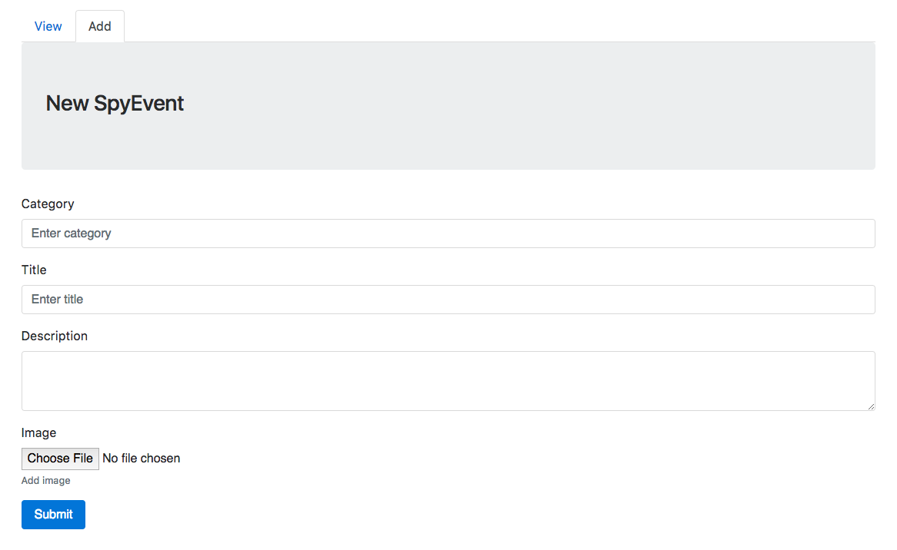

# Week assignment 2

Make a backend to the frontend you did last week.

App features:
  * Form to upload data and image (see image below)
  * Set the coordinates by clicking (Google etc.) map or get the coordinates from EXIF data.
    * [EXIF](https://github.com/gomfunkel/node-exif)
  * Upload image
    * _multer_
  * Convert image to small and medium versions
    * _sharp_
  * 1st version: Save the data from the form and image urls to data.json
     * _body-parser_
     * [Node Filesystem](https://nodejs.org/dist/latest-v6.x/docs/api/fs.html)
  * 2nd version: Save the data from the form and image urls to database
  * Display the updated data on the frontend

